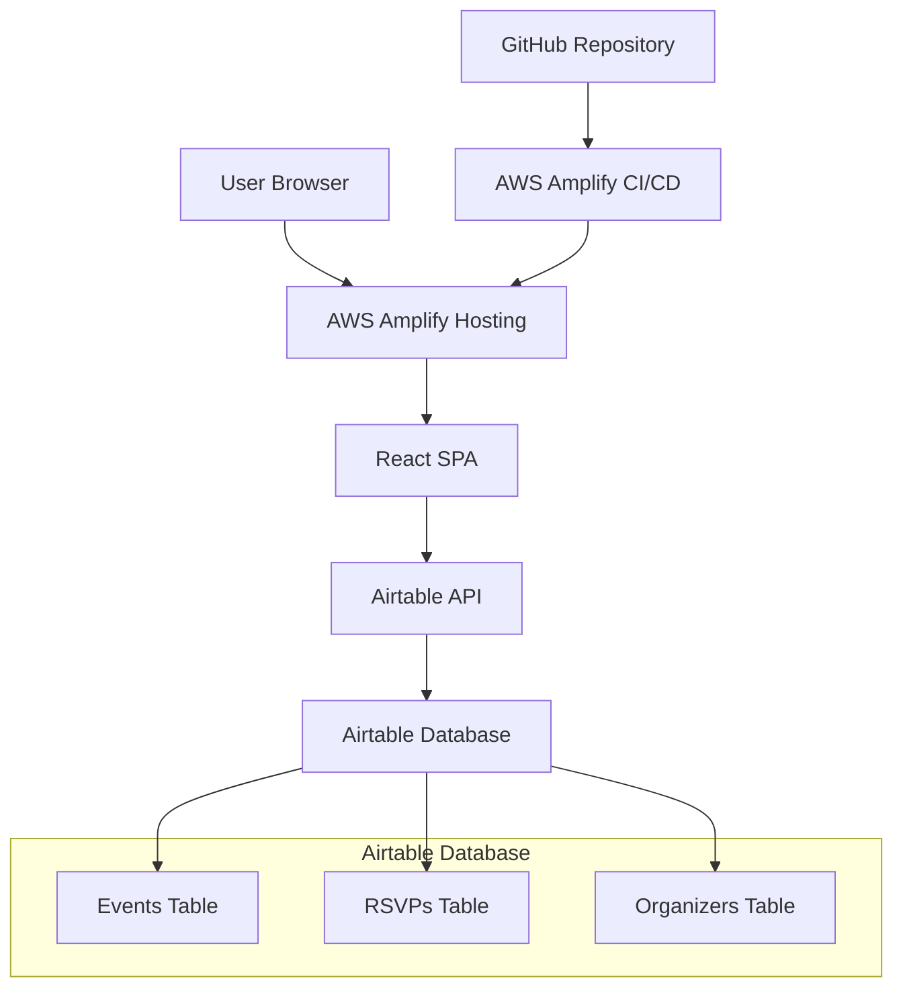

# Design Document

## Overview

The Event Management Platform is a modern web application built with React and deployed via AWS Amplify. It uses Airtable as a backend database to store event information and RSVP data. The application follows a serverless architecture pattern, leveraging client-side JavaScript to interact directly with Airtable's REST API.

The platform consists of three main user flows:
1. Event creation and management for organizers
2. Event discovery and RSVP for attendees  
3. Administrative dashboard for tracking events

## Architecture

### High-Level Architecture



### Technology Stack

- **Frontend**: React 18 with TypeScript
- **UI Framework**: Material UI (MUI) for components and theming
- **State Management**: React Context API with useReducer
- **HTTP Client**: Axios for Airtable API calls
- **Routing**: React Router v6
- **Form Handling**: React Hook Form with Zod validation
- **Deployment**: AWS Amplify with automatic CI/CD
- **Backend**: Airtable REST API

## Components and Interfaces

### Core Components

#### 1. Event Management Components
- `EventCreationForm`: Form for creating new events
- `EventCard`: Display component for event summaries
- `EventDetails`: Full event information display
- `EventEditForm`: Form for updating existing events
- `OrganizerDashboard`: Dashboard showing organizer's events

#### 2. RSVP Components
- `RSVPForm`: Form for attendees to RSVP
- `RSVPConfirmation`: Confirmation display after RSVP
- `AttendeeList`: List of current RSVPs for an event
- `RSVPStatus`: Shows user's current RSVP status

#### 3. Shared Components
- `Layout`: Main application layout with navigation
- `LoadingSpinner`: Loading state indicator
- `ErrorBoundary`: Error handling wrapper
- `NotificationToast`: User feedback notifications

### API Interface Layer

#### Airtable Service (`services/airtableService.ts`)

```typescript
interface AirtableService {
  // Events
  createEvent(event: CreateEventRequest): Promise<Event>
  getEvent(eventId: string): Promise<Event>
  updateEvent(eventId: string, updates: UpdateEventRequest): Promise<Event>
  getEventsByOrganizer(organizerId: string): Promise<Event[]>
  
  // RSVPs
  createRSVP(rsvp: CreateRSVPRequest): Promise<RSVP>
  getRSVPsByEvent(eventId: string): Promise<RSVP[]>
  updateRSVP(rsvpId: string, updates: UpdateRSVPRequest): Promise<RSVP>
  deleteRSVP(rsvpId: string): Promise<void>
  
  // Organizers
  createOrganizer(organizer: CreateOrganizerRequest): Promise<Organizer>
  getOrganizer(organizerId: string): Promise<Organizer>
}
```

## Data Models

### Airtable Schema

#### Events Table
- `id` (Primary Key): Auto-generated Airtable record ID
- `title` (Single line text): Event title
- `description` (Long text): Event description
- `date` (Date): Event date
- `time` (Single line text): Event time
- `location` (Single line text): Event location
- `capacity` (Number): Maximum attendees
- `organizer_id` (Single line text): Reference to organizer
- `created_at` (Date): Record creation timestamp
- `updated_at` (Date): Last update timestamp
- `share_link` (Formula): Generated shareable URL

#### RSVPs Table
- `id` (Primary Key): Auto-generated Airtable record ID
- `event_id` (Single line text): Reference to event
- `attendee_name` (Single line text): Attendee's name
- `attendee_email` (Email): Attendee's email
- `status` (Single select): "confirmed", "cancelled"
- `created_at` (Date): RSVP timestamp
- `updated_at` (Date): Last update timestamp

#### Organizers Table
- `id` (Primary Key): Auto-generated Airtable record ID
- `name` (Single line text): Organizer name
- `email` (Email): Organizer email
- `created_at` (Date): Registration timestamp

### TypeScript Interfaces

```typescript
interface Event {
  id: string
  title: string
  description: string
  date: string
  time: string
  location: string
  capacity: number
  organizerId: string
  createdAt: string
  updatedAt: string
  shareLink: string
}

interface RSVP {
  id: string
  eventId: string
  attendeeName: string
  attendeeEmail: string
  status: 'confirmed' | 'cancelled'
  createdAt: string
  updatedAt: string
}

interface Organizer {
  id: string
  name: string
  email: string
  createdAt: string
}
```

## Error Handling

### Client-Side Error Handling
- **Network Errors**: Retry mechanism with exponential backoff
- **Validation Errors**: Real-time form validation with user-friendly messages
- **API Rate Limits**: Queue requests and implement graceful degradation
- **Airtable Unavailable**: Show maintenance message with retry option

### Error Boundaries
- Global error boundary to catch unhandled React errors
- Component-level error boundaries for critical sections
- Fallback UI components for graceful degradation

### Error Types
```typescript
enum ErrorType {
  NETWORK_ERROR = 'NETWORK_ERROR',
  VALIDATION_ERROR = 'VALIDATION_ERROR',
  RATE_LIMIT_ERROR = 'RATE_LIMIT_ERROR',
  NOT_FOUND_ERROR = 'NOT_FOUND_ERROR',
  CAPACITY_EXCEEDED = 'CAPACITY_EXCEEDED'
}
```

## Testing Strategy

### Essential Testing
- **Core Components**: Basic tests for event creation and RSVP forms
- **API Service**: Tests for Airtable integration functions
- **Critical Workflows**: Manual testing of create event → share → RSVP flow

### Testing Approach
- Focus on testing the main user journeys manually during development
- Add unit tests only for complex business logic
- Use browser dev tools for responsive design testing

## Deployment and Infrastructure

### AWS Amplify Configuration
- **Build Settings**: React build process with environment variables
- **Environment Variables**: Airtable API key and base ID
- **Custom Headers**: Security headers for production
- **Redirects**: SPA routing support with fallback to index.html

### Performance Optimizations
- **Code Splitting**: Route-based code splitting with React.lazy
- **Image Optimization**: Responsive images with proper sizing
- **Caching**: Browser caching for static assets
- **Bundle Analysis**: Regular bundle size monitoring

### Security Considerations
- **API Key Management**: Environment variables for sensitive data
- **CORS Configuration**: Proper CORS setup for Airtable API
- **Input Sanitization**: XSS prevention for user inputs
- **Rate Limiting**: Client-side request throttling